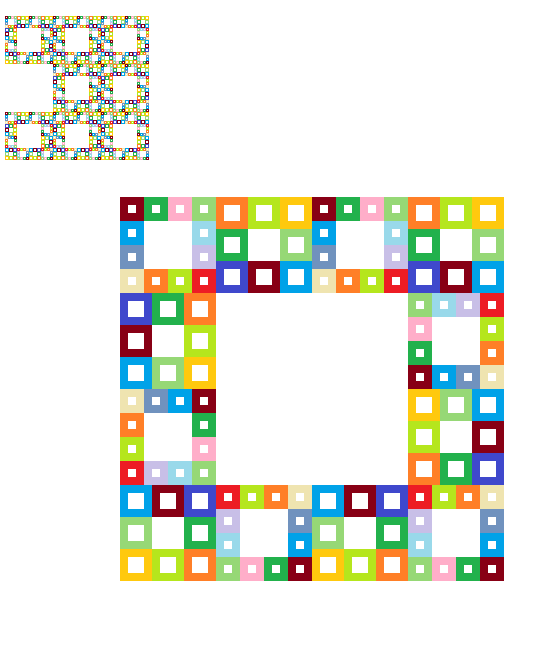

defining part enum variant on a markdon file system with copied system validation (`---` lines)

# github-upload environment_Memory


```vb.net
"to lose electromechanics for exercises"
```

Visit [It's sportish](https://github.com/ledlightjungledStefan/Osterei/blob/gutenberggnu/main/naming-convention.md) today!

    to start an integration of possibilities i learned with VB.Net to minimize affords
    to remember exercises and personal health issues.
